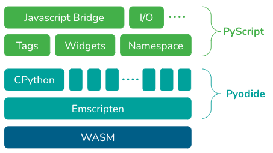

### Web Browser Python

#### Overview

- https://github.com/flexxui/flexx/wiki/PyScript-vs-X
- https://pythondev.readthedocs.io/wasm.html
- https://stromberg.dnsalias.org/~strombrg/pybrowser/python-browser.html
- https://realpython.com/brython-python-in-browser/#exploring-alternatives-to-brython

#### Transpilers

Compile Python to JS or WebAssembly (WASM)

- WASM
    - www.webassembly.guide/

- PyScript
    - https://pyscript.net
    - https://github.com/pyscript/pyscript
    - https://docs.pyscript.net/latest/reference/faq.html
    - https://docs.pyscript.net/latest/guides/asyncio.html
    - PyScript is built using Pyodide, the WebAssembly port of CPython, which is compiled using Emscripten.
    - Depends on a python runtime
        - Pyodide (Default)
            - needs to load a 10 mb runtime
        - MicroPython 
            - https://pyscript.net/tech-preview/micropython/about.html
            - https://github.com/micropython/micropython
            - More limited, but faster startup
    - Adds 
        - config.toml - configure extra packages to be loaded with pyodide
        - <script type="pyodide">
        - XWorker
        - other HTML plugins
- Pyodide
    - https://github.com/pyodide/pyodide
    - CPython distribution for WASM
- https://github.com/bytecodealliance/wasmtime-py
- Python 3.11.0 for WASM https://github.com/dbaeumer/python-3.11.0
- Transcrypt 
    - https://www.transcrypt.org
    - https://github.com/TranscryptOrg/Transcrypt
    - https://github.com/bunkahle/Transcrypt-Examples/tree/master/hello
    - Transpile Python to JS ahead of time, include the JS version in the Web Page
- PyJS - http://pyjs.org

- Batavia - Unmaintained, moved to PyScript
    - https://github.com/beeware/batavia
    - https://batavia.readthedocs.io/en/latest/background/faq.html
    - VM in JS for running CPython bytecode

- RapydScript
    - https://github.com/atsepkov/RapydScript

#### Interpreters

Interpreters for python in JS

- Brython
    - https://www.brython.info/speed_results.html
    - Python 3
    - https://brython.info/static_doc/en/intro.html
    - https://brython.info/static_doc/en/faq.html
- Skulpt 
    - https://github.com/skulpt/skulpt/tree/master
    - https://skulpt.org
    - https://skulpt.org/docs/index.html
    - Python 2

- Emscripten?? 
    - https://emscripten.org/docs/introducing_emscripten/about_emscripten.html
    - Emscripten is a complete compiler toolchain to WebAssembly, using LLVM