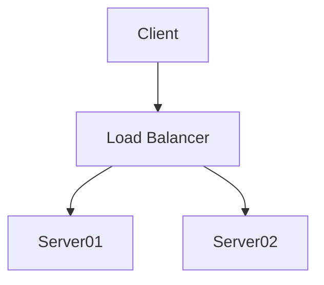

# Latex

- use \\input instead of \\include to avoid issues with missing directories and .aux files

+---------------+---------------+--------------------+
| Fruit         | Price         | Advantages         |
+===============+===============+====================+
| Bananas       | $1.34         | - built-in wrapper |
|               |               | - bright color     |
+---------------+---------------+--------------------+
| Oranges       | $2.10         | - cures scurvy     |
|               |               | - tasty            |
+---------------+---------------+--------------------+

| Right | Left | Default | Center |
|------:|:-----|---------|:------:|
|   12  |  12  |    12   |    12  |
|  123  |  123 |   123   |   123  |
|    1  |    1 |     1   |     1  |

  : Demonstration of simple table syntax.

  

> **_NOTE:_**  The note content.

 !! test sdfg

==asdff==

::asdff::

*[ip]: Internet Protocol

*[IP]: Internet Protocol

*[W3C]: World Wide Web Consortium

: sending raw bits over a physical medium  ip IP TCP tcp W3C 

