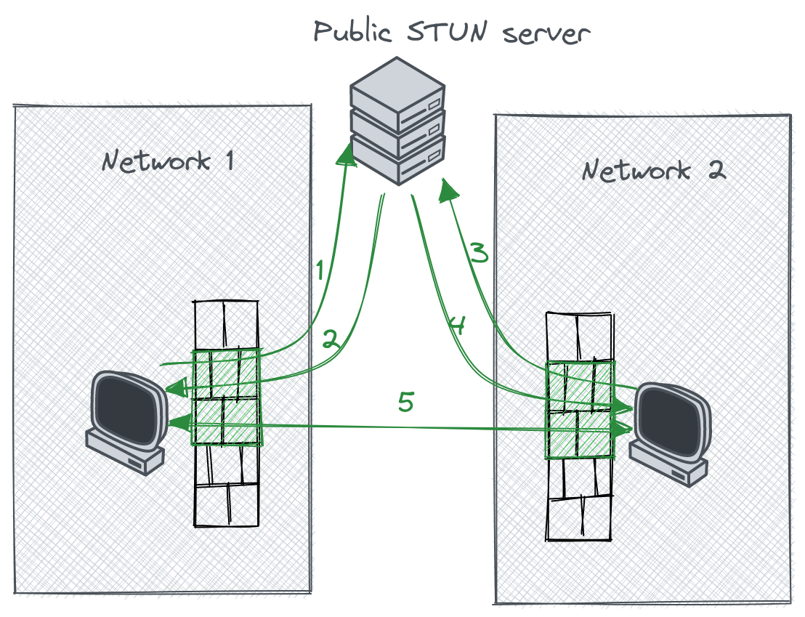

# Related work

In this chapter we will provide a high level overview of relevant solutions for connecting the parties of an MPyC multiparty computation over the internet. We will use the \gls{osi} model to help us categorize those solutions and highlight the similarities and differences between them. The OSI model has 7 layers with different responsibilities:
 
Layer 7 - Application:

: high level protocols that interact with user-facing services

Layer 6 - Presentation:

: translation of data between a networking service and an application, e.g. encoding, compression, encryption

Layer 5 - Session:

: session setup, management, tear-down, authentication, authorization

Layer 4 - Transport:

: sending data of variable length over a network while maintaining quality-of-service, e.g. ports, connections, packet fragmentation

Layer 3 - Network:

: sending data packets between two nodes, routed via a path of other nodes, e.g. addressing, routing

Layer 2 - Data link:

: sending data frames between two nodes, directly connected via a physical layer, e.g. on a LAN


Layer 1 - Physical:

: sending raw bits over a physical medium


While many protocols implement aspects of several layers and do not strictly fit inside the OSI model, it still a useful visualization tool. The diagram below shows an approximate OSI model mapping of several protocols and network overlay solutions from the point of view of the systems that use them and the arrows show dependency relations between them.

\newpage

{height=90% }

## The Internet

The modern Internet is a global multi-tiered network of devices that communicate using the protocols of the Internet Protocol Suite (TCP/IP). Typically, an \gls{isp} manages the physical infrastructure that connects an end-user's devices with the rest of the internet.

<!-- IP -->

The **\acrfull{ip}** is a Network (Layer 3) protocol of the Internet Protocol Suite that is responsible for delivering datagrams between devices across the boundaries of their \glspl{lan} by possibly routing traffic via multiple intermediate devices (routers). A datagram is a connectionless packet that is delivered on a best effort basis. It has a header that contains fields such as the **IP addresses** of its source and destination, and a payload that encapsulates the data from the protocols of the layers above. Routers are devices that are part of multiple networks and relay datagrams between them based on a routing table that maps IP address ranges (\gls{cidr}) to networks. 

**\acrfull{udp}** and **\acrfull{tcp}** are Transport (Layer 4) protocols that add the concept of ports to allow having multiple communication channels simultaneously between two devices. UDP provides best-effort delivery, while TCP is a reliable transport with delivery guarantees. TCP maintains stateful connections and handles acknowledgements and retransmissions in case of packets lost in transit.

**\acrfull{tls}** is a protocol that adds encryption on top of a reliable transport protocol such as TCP. It is usually placed in the Presentation Layer (Layer 6), but it does not strictly fit in any single OSI layer. It is rather complex because it needs to support many possible use cases across the internet. \todo{tls} The **Noise Protocol Framework** [@noiseDocs] is a more \todo{noise is transport agnostic} \todo{noise has limited cipher suites} recent effort that applies the ideas of TLS in a simplified way by serving as a blueprint for designing use-case specific protocols for establishing secure communication channels based on \gls{ecdh} handshake patterns. It powers the end-to-end encryption in messaging applications such as WhatsApp and Signal, and \gls{vpn} software such as WireGuard and Nebula.


The version of the Internet Protocol that was originally deployed globally (IPv4) uses 32-bit numbers as IP addresses, allowing for up to 4, 294, 967, 296 unique addresses. Due to the popularity of the internet, there are many more devices than available IPv4 addresses, which has caused challenges. IPv6 is a newer version of the protocol that uses a larger 128-bit address space, but it's adoption has been slow. A more widespread solution is **\gls{nat}**. It allows many devices without globally unique IP addresses to initiate connections to publicly addressable devices on the Internet via a limited number of gateways that must have globally unique IP addresses. A NAT gateway replaces the local source IP address of each outgoing IP datagram with its own public IP address before passing it on to the next link on the way to the destination while maintaining a mapping between the source and destination IPs in a translation table. The destination host can then address its responses back to the NAT gateway's public IP address, which in turn replaces its own IP from the incoming datagrams with the IP of the local device and relays them to it. If the IP datagrams encapsulate TCP/UDP packets, the gateway additionally rewrites the source and destination ports, which means that NAT techniques can be placed somewhere between Layers 3 and 4 of the OSI model. 

The NAT approach allows devices with local IP addresses to initiate bidirectional connections with remote devices across the public internet but it does not natively allow those remote devices to initiate a connection first. Furthermore as Figure \ref{nat-intro} shows, when two different devices are behind separate NATs, neither can contact the other one first, which causes problems for many Peer-to-Peer protocols. There are several **NAT traversal** techniques that try to aleviate this drawback with varying success and performance tradeoffs.


{ height=25% width=50% }


In many home networks the role of a NAT gateway is played by a publicly addressable router under the user's control, which often allows for port forwarding to be configured either manually or programmatically via a Layer 7 protocol like **\gls{upnp}** or its successors **\gls{nat-pmp}** and **\gls{pcp}**. This would allow remote hosts to initiate connections with the local ones if they know the router's public IP address. Those protocols however are not always supported by the router and are often disabled by the local network administrators due to the security concerns of maliscious programs being able to request and modify the port mappings in the router's translation tables.

Another approach for NAT traversal is **\gls{stun}**, which relies on the predictable port mapping algorithms that many routers use and a public third party host that can be contacted by the local devices and later serve as an introduction point for them (Figure \ref{nat-traversal}).

\todo{rewrite this text from the preparation phase by separating the discussions of STUN and Mesh VPNs, which will be introduced in the next section after we've looked at the lower level protocols}

> \gls{udp} hole punching based on concepts from \gls{stun}. The machines of each party can contact a public \gls{stun} server \ref{nat-traversal}, which will note what \gls{ip} addresses the connections come from and inform the parties. Since the parties initiated the connection to the STUN server, their routers will keep a mapping between their local IP addresses and the port that was allocated for the connection in order to be able to forward the incoming traffic. Those "holes" in the NATs were originally intended for the STUN server, but mesh VPNs use the stateless "fire and forget" UDP protocol for their internal communication, which does not require nor provides a mechanism for the NATs to verify who sent a UDP packet. With most NATs, this is enough to be able to (ab)use the "punched holes" for the purpose of \gls{p2p} traffic from other parties. Mesh VPNs implement the stateful \gls{tcp} and \gls{tls} protocols on top of UDP and expose an regular network interface to the other programs, keeping them shielded from the underlying complexities. Other NAT implementations such as Symmetric NAT and \glspl{cgnat} can be more difficult to "punch through" due to their more complex port mapping strategies. In those cases, establishing P2P connections might involve guess work or even fail and require falling back to routing the (encrypted) traffic via another party or service.


{ height=25% width=50% }

In most mobile networks (4G, 5G) the \gls{isp} utilizes a **\gls{cgnat}** as part of their infrastructure, while all devices under the user's control, including the router only have local IP addresses. STUN techniques would fail to discover a direct path between two parties behind separate CGNATs or other unpredictable NAT algorithms. The only remaining possiblity is for a techniques like **\acrfull{turn}**, where a publicly reachable third party host is used not only for introducing the peers but also for relaying all (possibly encrypted) traffic between them. 

- **\acrfull{ipsec}**
  - Layer 3 protocol suite part of the Internet Protocol Suite
  - used inside VPN software
  - has implementations in both user and kernel space as well as hardware implementations
  - rewrites and encrypts the IP headers and payloads
  - virtual routing table
  - Initially was built into IPv6, separate from IPv4


## Network overlays

Most Network Overlay solutions can be placed in Layers 2, 3 or 7. 

### TUN/TAP driver


- Layer 2 vs Layer 3 Networks
  - Layer 2 overlays bridge networks
    - virtual network switch
    - remote machines are on the same virtual LAN and can share the same IP address range
    - allows broadcast/multicast
    - TAP driver
  - Layer 3 overlays route traffic between separate local networks
    - virtual network router
    - remote machines are on separate LANs
    - simpler to configure
    - TUN driver

### Traditional VPNs

\glspl{vpn} are implemented as Layer 2 or 3 network overlays. They are commonly used for securely connecting machines from different \glspl{lan}. They provide software emulation of a network interface controller via a TUN/TAP driver on the operating system level and allow other software to transparently use the functionality of the \gls{ip} suite without requiring extra changes. Traditional \glspl{vpn} such as IPSec [@ipSecDocs] and OpenVPN [@openVPNDocs] use a centralized service that all (encrypted) client communications must pass through. This introduces a single point of failure and a potential bottleneck that might negatively impact the performance of the multi-party computations due to their \gls{p2p} nature.

### WireGuard

WireGuard [@donenfeldWireGuardNextGeneration2017] is a more recent protocol with a design informed by lessons learned from IPSec and OpenVPN and a key management approach inspired by SSH. It is a lower level protocol that focuses on configuration simplicity while network topology, peer discovery and key distribution are left as a responsibility of higher level systems that use it as a building block. Wireguard is implemented as a Layer 3 overlay over UDP tunnels. WireGuard has both user space implementations that use a TUN driver and also has direct support built into the Linux Kernel since version 5.6 (May 2020). The kernel implementation allows for better performance because it does not need to copy packets between the kernel and user-space memory.

The snippets below show a minimal set of configuration options that need to be provided in order for two peers to be able to form secure tunnels with each other.

```ini
# peer1.conf
[Interface]
Address = 101.0.0.1/32
ListenPort = 53063
PrivateKey = ePTiXXhHjvAHdWUr8Bimk30n0gh3m241RAzsN0JZDW0=

[Peer]
PublicKey = BSn0ejd1Y3bKuD+Xpg0ZZeOf+Ies/oql0NZxw+SOmkc=
AllowedIPs = 101.0.0.2/32
Endpoint = peer1.example.com:38133
```

```ini
# peer2.conf
[Interface]
Address = 101.0.0.2/32
ListenPort = 38133
PrivateKey = sN/d6XUPEVPGSziVgCCOnOivDK+qAoYC3nxnssQ5Rls=

[Peer]
PublicKey = e/TxvPmrgcc1G4cSH2bHv5J0PRHXKjYxTFoU8r+G93E=
AllowedIPs = 101.0.0.1/32
```

Each peer has a public/private key pair that is used for authentication and encryption based on the Noise Protocol Framework [@noiseDocs]. The `Address` field specifies the virtual IP address that the local network interface will use, while the `AllowedIPs` field specifies what virtual IP addresses are associated with a peer's public key. A peer's `Endpoint` field specifies the URL at which it can be reached. Only one of the peers must be configured with a reachable endpoint for the other one. In the above example once `peer1`  initiates communication with `peer2`, `peer2` will learn the current endpoint of `peer1` and will be able to communicate back with it.

### Mesh VPNs

- Tinc
- N2N
- Tailscale
- Nebula
- ZeroTier

Mesh \glspl{vpn} such as Tinc [@tincDocs], Tailscale [@tailscaleDocs] and Nebula [@nebulaDocs] utilize NAT Traversal techniques in order to create direct \gls{p2p} links between the clients for the data traffic. Authentication, authorization and traffic encryption are performed using certificates based on public key cryptography.

All three are open-source, with the exception of Tailscale's coordination service which handles the peer discovery and identity management. Headscale [@fontJuanfontHeadscale2022] is a community driven open-source alternative   for that component. Tinc is the oldest of the three but has a relatively small community. It is mainly developed by a single author and appears to be more academic than industry motivated.
Nebula and Tailscale are both business driven. Tailscale was started by a number of high profile ex-googlers and is the most end-user focused of the three, providing a service that allows people to sign up using a variety of identity providers including Google, Microsoft, GitHub and others. They also provide an Admin console that allows a user to easily add their personal devices to a network or share them with others. It also has support for automation tools like Terraform for creating authorization keys and managing an \gls{acl} based firewall.
Nebula was originally developed at the instant messaging company Slack to create overlay networks for their cross region cloud infrastructure, but the authors later started a new company and are currently developing a user-centric platform similar to Tailscale's.  Nebula is more customizable than Tailscale and since it is completely open-source it can be adapted to different use cases, but it is also more involved to set up. A certificate authority needs to be configured for issuing the identities of the participating hosts. Furthermore, publicly accessible coordination servers need to be deployed to facilitate the host discovery.
Tailscale employs a distributed relay network of \gls{derp} servers, while Nebula can be configured to route via one of the other peers in the VPN.

### Layer 7 overlays

#### WebRTC is 
* WebRTC
    - Uses STUN/TURN
    - 
* OpenZiti
    - uses relays
* ngrok
* TOR
* BitTorrent
* IPFS
* Ethereum
* Teleport
* Freenet
