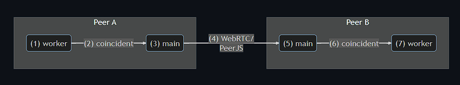

## MPyC Web

This chapter presents the design of MPyC Web - an MPC connectivity solution based on web technologies (L7) that can run in web browsers.

Design goals:

- Runs in browsers (client-side) on both PCs and smartphones
- Uses the MPyC Python framework with as few modifications as possible
- Peer-to-peer with a fallback to relaying
- Secure
- Simple to use

### Python Runtime Selection

<!-- While Python is not natively supported in browsers that traditionally allow only -->

<!-- , including Python, with different tradeoffs -->
#### Selection Criteria

While web browsers natively support only \gls{js}, there are approaches with different tradeoffs that can enable other languages, including Python. In this section we will investigate several web-based Python runtimes and choose the most appropriate one for MPyC Web.

MPyC depends on several Python packages that are implemented in C, such as numpy, gmpy2, scipy and relies heavily on asyncio and TCP sockets from Python's standard library. The runtime we choose should support as many of those dependencies as possible to avoid having to find alternatives or reimplement them.

Another important aspect is the runtime performance due to the heavy operations involved in \as{mpc}s. We will benchmark each runtime by measuring the time it takes to execute a simple Python script that adds numbers in a loop.

Fast startup time, low build and deployment complexity are less crucial but nice to have properties of the runtime, as they offer a better experience for both users and developers.

To summarize, our criteria for runtime selection are:

- Python ecosystem/package availability
- Runtime performance
- Startup, build and deployment time

#### Available Solutions

There are a number of available solutions for using Python in web browsers, falling under three main categories[@pyodideIntroMozilla] [@anvilPythonBrowser]:

1. Transcrypt[@transcryptRepo] - \gls{aot} JavaScript transpiler - the Python code is transpiled to JavaScript and the resulting code is executed by the browser at runtime. is an example project 
2. Skulpt[@skulptDocs], Brython[@brythonDocs] - \gls{jit} JavaScript interpreters - the Python code is converted to JavaScript in the browser at runtime
3. Pyodide[@pyodideDocs], MicroPython[@microPythonDocs], RustPython[@rustPythonDocs] - \gls{wasm}[@wasmDocs] interpreters - a Python interpreter is implemented in a compiled language like C/C++/Rust/Go that can target WASM - a secure and efficient binary instruction format for a virtual machine that can run in browsers with close to native performance.


#### Preliminary Runtime Benchmarks

 
- 
- <!--   --> 
- <!--    --> 
- 

|                 | **Benchmark** |              | **Results** |              | **(ops/sec)** |              |               |            |
| --------------- | ------------- | ------------ | ----------- | ------------ | ------------- | ------------ | ------------- | ---------- |
| \MB Project     | **assign**    | **multiply** | **bigint**  | **randlist** | **cpylist**   | **sortlist** | **fibonacci** | **primes** |
| \HF JavaScript  | 19,327        | 19,413       | 19,351      | 713          | 4,227         | 35           | 3,271         | 1,029      |
| \HF CPython     | 775           | 380          | 69          | 21           | 4,280         | 81           | 168           | 200        |
| \HL Transcrypt  | 1,289         | 1,285        | 1,282       | 176          | 6,135         | 35           | 337           | 1124       |
| \HL Skulpt      | 40            | 27           | 1           | 16           | 6,232         | 5.2          | 8             | 18         |
| \HL Brython     | 292           | 166          | 45          | 0.7          | 5,076         | 67           | 9             | 45         |
| \HLM Pyodide    | 400           | 111          | 26          | 5            | 4,425         | 45           | 53            | 73         |
| \HL MicroPython | 69            | 36           | 6           | 16           | 403           | 41           | 22            | 10         |
| \HL RustPython  | 60            | 59           | 8           | 0.8          | 525           | 0.1          | 6             | 6          |

Table: Benchmark results of the Python runtimes measured in operations per second for inputs of size 100 000

```Python
import itertools
import random
import sys
import time

bench_input_size = 100000
bench_min_duration = 0.2
bench_best_of = 3

def is_brython():
    return "Brython" in str(sys.version)
def is_skulpt():
    return "Skulpt" in str(sys.version)
def is_micropython():
    return "MicroPython" in str(sys.version)
def is_rustpython():
    return "rustc" in str(sys.version)
if is_micropython():
    import js
    def print(s):
        js.document.currentScript.target.innerHTML += s + "<br />"  
if is_brython() or is_skulpt() or is_micropython():
    range_fn = range
else:
    range_fn = lambda iters: itertools.repeat(None, iters)  # Pyodide  

if hasattr(time, "ticks_ms"):
    default_timer = time.ticks_ms
    default_time_diff = lambda a, b: time.ticks_diff(a, b) / 1000.0
elif hasattr(time, "time"):
    default_timer = time.time
    default_time_diff = lambda a, b: a - b
def timeit(func, iterations=bench_input_size, timer=default_timer, time_diff=default_time_diff):
    t1 = timer()
    res = func()
    for _ in range_fn(iterations - 1):
        func()
    timing = time_diff(timer(), t1)
    return timing, res
def autorange(func):
    i = 1
    while True:
        for j in 1, 2, 5:
            iterations = i * j
            time_taken, res = timeit(func, iterations)
            if time_taken >= bench_min_duration:
                return (round(iterations / time_taken, 2), res)
        i *= 10
def bench(func):
    def wrapper(*args, **kwargs):
        maxOpS = 0
        res = None
        def handle():
            return func(*args, **kwargs)
        for _ in range(bench_best_of):
            ops, res = autorange(handle)
            maxOpS = max(maxOpS, ops)
        print_bench(func.__name__, maxOpS, *args, **kwargs)
        return res
    return wrapper
def print_bench(name, t, *args, **kwargs):
    args_repr = [repr(arg) for arg in args]
    kwargs_repr = [f"{key}={repr(value)}" for key, value in kwargs.items()]
    args_fmt = ", ".join(args_repr + kwargs_repr)
    print(f"{name}({args_fmt}): {t:,} ops/sec")
@bench
def assign(iters=bench_input_size):
    for _ in range_fn(iters):
        x = 1
@bench
def multiply(iters=bench_input_size):
    a, b = 17, 41
    for _ in range_fn(iters):
        x = a * b
@bench
def bigints(iters=bench_input_size):
    n = 60
    for _ in range_fn(iters):
        2**n
@bench
def randlist(size=bench_input_size):
    return [random.randint(0, size) for _ in range(size)]
l = None
@bench
def cpylist():
    return l.copy()
@bench
def cpylist2():
    return l[:]
@bench
def sortlist():
    return l.copy().sort()
@bench
def fibonacci(n=bench_input_size):
    if n < 2:
        return n
    a, b = 1, 2  
    for _ in range_fn(n - 1):
        a, b = b, (a + b) % 100000
    return a 
@bench
def primes(n=bench_input_size):
    if n == 2:
        return [2]
    if n < 2:
        return []
    s = list(range(3, n + 1, 2))
    mroot = n**0.5
    half = (n + 1) // 2 - 1
    i = 0
    m = 3
    while m <= mroot:
        if s[i]:
            j = (m * m - 3) // 2
            s[j] = 0
            while j < half:
                s[j] = 0
                j += m
        i = i + 1
        m = 2 * i + 3
    return [2] + [x for x in s if x]
assign()
multiply()
bigints()
l = randlist()
cpylist()
cpylist2()
sortlist()
fibonacci()
primes()
```


 Out of the discussed runtime options, Pyodide offers the widest support for packages from the standard library and third-party packages. None of the options support the sockets package due to browser limitations, but an alternative implementation can be built on top of the WebRTC API.

Out of those projects, Py

\newpage


| **Project**     | **Approach**                         | **Startup** | **Benchmark** | **Ecosystem**         |
| --------------- | ------------------------------------ | ----------- | ------------- | --------------------- |
| \MB Transcrypt  | transpiler (\as{aot})                | 0s          | slow          | $$(-)$$ n/a           |
| \HL Skulpt      | \as{js}-based interpreter (\as{jit}) | 0s          | slow          | $$(-)$$ n/a           |
| \HL Brython     | JS-based interpreter (JIT)           | 0s          | 1,370 op/s    | $$(-)$$ no numpy      |
| \HLM Pyodide    | \as{wasm}-based interpreter (JIT)    | 5s          | 298 op/s      | $$(+)$$ asyncio       |
|                 |                                      |             |               | $$(+)$$ numpy         |
|                 |                                      |             |               | $$(+)$$ gmpy2         |
|                 |                                      |             |               | $$(+)$$ scipy         |
|                 |                                      |             |               | $$(+)$$ python wheels |
|                 |                                      |             |               | $$(+)$$ filesystem    |
| \MB             |                                      |             |               | $$(-)$$ no sockets    |
| \HL MicroPython | WASM-based interpreter (JIT)         | 1s          | fast          | $$(-)$$ n/a           |
| \HL RustPython  | WASM-based interpreter (JIT)         | 5s          | fast          | $$(-)$$ n/a           |

Table: Summary of Python runtimes for browsers

<!--

The load time for the runtime of the python interpreter compiled to WebAssembly is around 5-10 seconds depending on the specific project.

The moment of compilation is not as important in our case but for context transpiling Python to JavaScript has to happen in a separate step ahead of time, while with the other approaches there is a Python interpreter in the browser, which allows it to execute the Python code and to modify it at runtime for demonstration purposes.

-->

<!--
Traditionally, web browsers support JavaScript, but the introduction of WebAssembly in 2017 made it possible to use other languages as well. Python
-->
### Design of MPyC Web
Web based solution for running MPC in browsers on the client side via WebAssembly and WebRTC for peer-to-peer connectivity.

The lifecycle of a message between the workers of 2 peers, "Peer A" and "Peer B" looks like this:

{ height=90% }

1. Python Worker on Peer A

   - creates a message that contains a secret share computed via the mpyc, which serializes it to binary via struct.pack(). The resulting message is non-ascii, but when escaped can look like this:

   ```python
   b'\x06\x00\x00\x00\xc9\x93\\\xc0\xff\xff\xff\xff\x04\x00\x80\x99\x1b\x01'
   ```

   - worker calls a main thread function (sendRuntimeMessage) via a coincident proxy and passes the serialized value, as well as the destination Peer's ID (Peer B). The worker does not need to await the result of this call, but it does because of xworker.sync.

2. Coincident handles the message by:

   - (Worker) JSON.stringify() -> Atomics.wait()
   - (Main) JSON.parse() -> Run the Main Thread function -> Atomics.notify()

3. Main thread on Peer A fires an event to notify PeerJS that it needs to transport the message and immediately returns in order to not block the Worker

4. PeerJS serializes the message with some added fields via MessagePack and transmits it to Peer B

5. Main thread on Peer B receives the message and forwards it to the appropriate worker callback via coincident

6. Coincident does the JSON.stringify() -> Atomics.wait() stuff (?) from main to worker on Peer B

7. Worker on Peer B handles the message by passing it to an asyncio coroutine that is waiting for it or stores it for later use

### Implementation details

### Performance analysis

### Security analysis

#### Trust model

There still is a centralized service like in the Tailscale solution, but here it is self-deployed.

#### Identity

### Usability analysis
